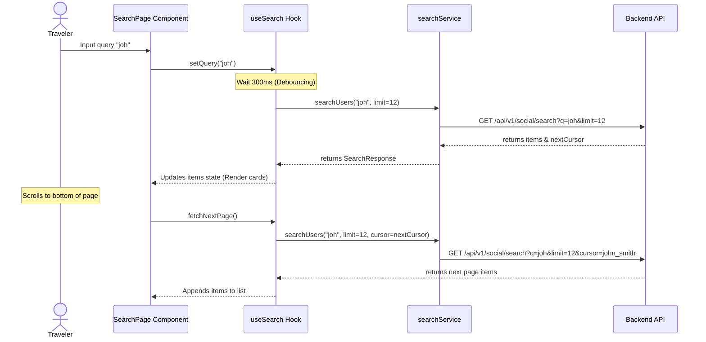
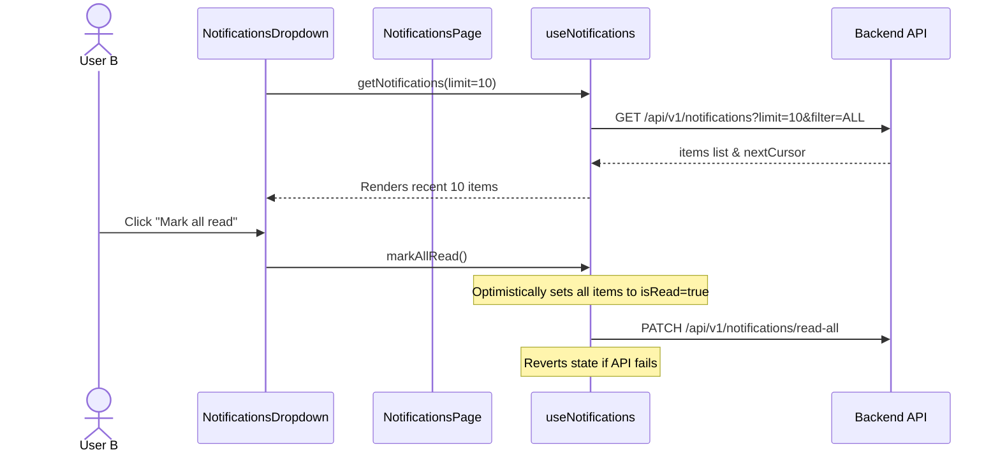
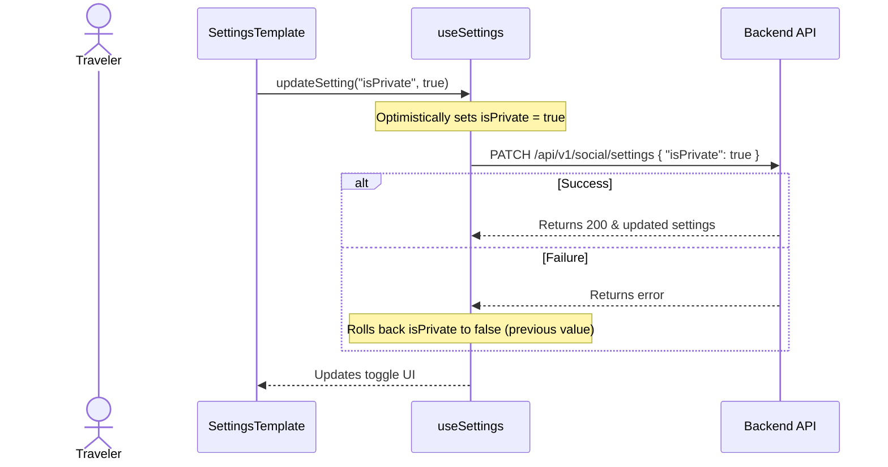

# Frontend Social Platform Integration (Phase 2.0)

This document describes the architectural patterns, folder structure, query flows, and integration details for the Social Platform features (Search, Notifications, and Settings) implemented in YouGO Frontend Phase 2.0.

---

## 1. Overview

In Phase 2.0, the YouGO frontend was fully connected to the production-grade NestJS/Hono backend APIs for:
1. **User Discovery & Search**: Providing relevance-sorted user search, debounced input query bindings, and cursor-paginated infinite scrolling.
2. **Notifications Infrastructure**: A fully featured notification timeline (`/notifications`) and an interactive header dropdown featuring unread count badges, single read triggers, and bulk read operations.
3. **Account & Social Settings**: Privacy toggles (Private Account, Search Discoverability), Direct Message permissions, and Notification preferences synchronized with optimistic UI state transitions and automated rollbacks on failure.

---

## 2. Architecture & Design Decisions

### Why This Architecture Was Chosen

1. **Separation of Concerns (Thin UI Component Pattern)**:
   All business operations, HTTP queries, state variables, and side-effects are decoupled from JSX rendering and managed inside dedicated services (`app/services/`) and reusable hooks (`app/hooks/`). This makes UI components simple, pure, and highly testable.
2. **Service Layer Abstraction**:
   All fetch interactions are centralized inside modular services using the `apiFetch` wrapper. This eliminates raw `fetch()` calls scattered across components and provides a single configuration point for headers, cookies, and tokens.
3. **Cursor-Paginated Client-State Lifecycle**:
   By using custom state loops with cursor trackers (`nextCursor`), the client avoids offset scanning in list views. It maintains constant-time $O(1)$ query seeks, matching backend design decisions.
4. **Optimistic UI Updates with Rollback**:
   Settings updates are performed optimistically to eliminate latency perception. Toggles switch instantly. If the backend fails, the hook automatically restores the user's previous configuration.

---

## 3. Folder Structure & Component Hierarchy

```
app/
├── components/
│   ├── dashboard/
│   │   ├── dashboard-layout.tsx     # Handles responsive sidebar/layout visibility
│   │   ├── header.tsx               # Header displaying username, profile link, and dropdown
│   │   └── notifications-dropdown.tsx # [MODIFIED] Dropdown listing recent notifications
│   └── settings/
│       └── settings-template.tsx    # [MODIFIED] Settings tab forms (Profile, Privacy, Notifications)
├── hooks/                           # [NEW] Reusable state & query hooks
│   ├── useSearch.ts                 # Search query, debouncing, and cursor pagination
│   ├── useNotifications.ts          # Notifications fetch, read, read-all, and pagination
│   ├── useUnreadCount.ts            # Dynamic unread notifications badge count
│   └── useSettings.ts               # Settings fetch and optimistic update actions
├── notifications/                   # [NEW] Notifications timeline route
│   └── page.tsx                     # Renders filters, notifications timeline, infinite scroll
├── search/
│   └── page.tsx                     # [MODIFIED] User discovery with IntersectionObserver pagination
├── services/                        # [NEW] Typed API calls layer
│   ├── search.service.ts            # Search API requests
│   ├── notification.service.ts      # Notifications fetch, read-all, and count requests
│   └── settings.service.ts          # Settings fetch and update requests
└── types/
    └── social.ts                    # [NEW] Types matching backend API response structures
```

---

## 4. Feature Flow Details & Query Paths

### Search Flow



1. **Debouncing**: `useSearch` hooks a `setTimeout` to `query` changes. It delays the backend trigger by 300ms to avoid spamming searches on every keystroke.
2. **Infinite Scroll**: An `IntersectionObserver` tracks the last rendered user card. When visible, it calls `fetchNextPage()` if `nextCursor` exists.
3. **Status Routing**: Clicking a search result card triggers Next.js navigation directly to the user's public profile `/profile/[username]`.

---

### Notification Flow



1. **Read Status Sync**: The `useUnreadCount` hook listens for standard browser events (`refetch-unread-count`) to fetch the current badge count. When notifications are read locally, they trigger cross-component refetches of this badge.
2. **Paginated Timeline**: The `/notifications` route supports three filters: All, Unread, and Read. Filters invoke initial page fetches. Scrolling invokes paginated extensions using next-cursor limits.
3. **Permissions-based UI**: Notification actors and actions match the database schema parameters. System notifications render generic alerts, while social events link to interactive creator profiles.

---

### Settings Flow



1. **Dynamic Tab Routing**: Handled using `framer-motion` layouts for performance and responsive layout transitions.
2. **Privacy Tab**:
   - **Private Account (`isPrivate`)**: Controls whether the profile is public or restricted.
   - **Discoverability (`isDiscoverable`)**: Excludes or includes the user in global search results.
   - **Messaging Boundary (`messagingPermission`)**: Radio select determining who is allowed to initialize conversation threads.
3. **Notification Preferences**:
   - Toggles configuration for Email updates (`notifyEmail`), chat alerts (`notifyMessages`), and social follows (`notifyFollowRequests`).

---

## 5. Loading, Error & Accessibility Strategies

- **Loading Skeleton Systems**: To prevent layout shifts (CLS), pulsing container skeletons (`LoadingSkeleton`) matching the cards' grid heights are rendered during queries.
- **Retry Options**: Error panels in Search, Notifications, and Settings contain clean "Retry" triggers that refetch initial pages.
- **Empty States**: Customized illustration-based empty indicators are rendered for no notifications or no search query matches.
- **Accessibility**:
  - Interactive controls (Toggles, Selects, Buttons) use semantic HTML.
  - Buttons use high color contrast settings and support focused states.
  - Skeletons use clean `aria-hidden` attributes to avoid interfering with screen readers.
