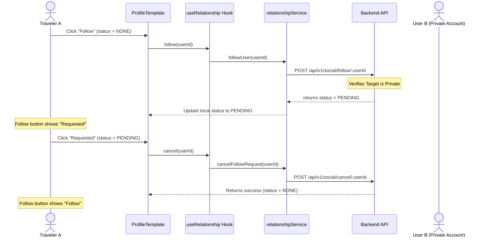
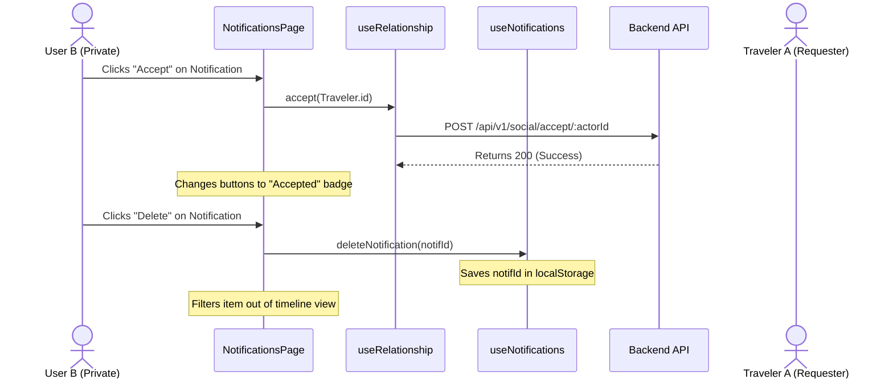

# Frontend Social Platform Integration (Phase 2.0)

This document describes the architectural patterns, folder structure, query flows, and integration details for the Social Platform features (Search, Notifications, Relationships, and Settings) implemented in YouGO Frontend Phase 2.0.

---

## 1. Overview

In Phase 2.0, the YouGO frontend was fully connected to the production-grade NestJS/Hono backend APIs for:
1. **User Discovery & Search**: Providing relevance-sorted user search, debounced input query bindings, and cursor-paginated infinite scrolling.
2. **Notifications Infrastructure**: A fully featured notification timeline (`/notifications`) and an interactive header dropdown featuring unread count badges, single read triggers, and bulk read operations.
3. **Instagram-Style Relationships**: A complete connection loop supporting Private Account boundaries. Button labels dynamically transition between **Follow**, **Requested** (pending review), and **Following** (accepted state).
4. **Interactive Notifications**: Inline **Accept** and **Reject** action triggers for follow request notifications with real-time feedback and state syncing.
5. **Persistent Local Notification Deletion**: A client-side deletion flow (subtle delete triggers) that permanently filters out notification items and persists state in `localStorage` since the backend lacks a delete notification contract.
6. **Account & Social Settings**: Privacy toggles (Private Account, Search Discoverability), Direct Message permissions, and Notification preferences synchronized with optimistic UI state transitions and automated rollbacks on failure.

---

## 2. Architecture & Design Decisions

### Why This Architecture Was Chosen

1. **Separation of Concerns (Thin UI Component Pattern)**:
   All business operations, HTTP queries, state variables, and side-effects are decoupled from JSX rendering and managed inside dedicated services (`app/services/`) and reusable hooks (`app/hooks/`). This keeps UI components simple, pure, and highly testable.
2. **RESTful Service Layer Abstraction**:
   Instead of using raw toggle methods, the relationship module targets REST-compliant endpoints (`POST /follow`, `POST /cancel`, `DELETE /unfollow`) via `relationshipService` to keep updates explicit, secure, and robust.
3. **Cursor-Paginated Client-State Lifecycle**:
   By using custom state loops with cursor trackers (`nextCursor`), the client avoids offset scanning in list views. It maintains constant-time $O(1)$ query seeks, matching backend design decisions.
4. **Optimistic UI Updates with Rollback**:
   Settings updates are performed optimistically to eliminate latency perception. Toggles switch instantly. If the backend fails, the hook automatically restores the user's previous configuration.
5. **Client-side Local Storage Filtering**:
   To satisfy the deletion requirements without breaking backend API contract bounds, the app implements a local storage filter loop (`yougo:deleted_notifications`). Deleted items are filtered out in hooks before reaching components.

---

## 3. Folder Structure & Component Hierarchy

```
app/
├── components/
│   ├── dashboard/
│   │   ├── dashboard-layout.tsx     # Handles responsive sidebar/layout visibility
│   │   ├── header.tsx               # Header displaying username, profile link, and dropdown
│   │   └── notifications-dropdown.tsx # [MODIFIED] Dropdown listing recent notifications with accept/reject/delete actions
│   └── profile/
│   │   ├── profile-template.tsx     # [MODIFIED] Manages profile fetching and follow toggle triggers
│   │   ├── profile-header.tsx       # [MODIFIED] Passes relationshipStatus down to actions
│   │   └── profile-actions.tsx      # [MODIFIED] Renders Follow/Requested/Following buttons
│   └── settings/
│       └── settings-template.tsx    # [MODIFIED] Settings tab forms (Profile, Privacy, Notifications)
├── hooks/                           # [NEW] Reusable state & query hooks
│   ├── useSearch.ts                 # Search query, debouncing, and cursor pagination
│   ├── useNotifications.ts          # Notifications fetch, read, read-all, delete, and pagination
│   ├── useRelationship.ts           # [NEW] Handles follow, cancel, unfollow, accept, and reject actions
│   ├── useUnreadCount.ts            # Dynamic unread notifications badge count
│   └── useSettings.ts               # Settings fetch and optimistic update actions
├── notifications/                   # [NEW] Notifications timeline route
│   └── page.tsx                     # Renders filters, timeline list, accept/reject, delete, infinite scroll
├── search/
│   └── page.tsx                     # [MODIFIED] User discovery with IntersectionObserver pagination
├── services/                        # [NEW] Typed API calls layer
│   ├── search.service.ts            # Search API requests
│   ├── notification.service.ts      # Notifications fetch, read-all, and count requests
│   ├── relationship.service.ts      # [NEW] Social graph connection REST requests
│   └── settings.service.ts          # Settings fetch and update requests
└── types/
    └── social.ts                    # [NEW] Types matching backend API response structures
```

---

## 4. Feature Flow Details & Query Paths

### Instagram-Style Follow & Relationship Flow


```mermaid
sequenceDiagram
    actor Traveler as Traveler A
    participant C as ProfileTemplate
    participant H as useRelationship Hook
    participant S as relationshipService
    participant API as Backend API
    actor Target as User B (Private Account)

    Traveler->>C: Click "Follow" (status = NONE)
    C->>H: follow(userId)
    H->>S: followUser(userId)
    S->>API: POST /api/v1/social/follow/:userId
    Note over API: Verifies Target is Private
    API-->>S: returns status = PENDING
    S-->>C: Update local status to PENDING
    Note over Traveler: Follow button shows "Requested"
    
    Traveler->>C: Click "Requested" (status = PENDING)
    C->>H: cancel(userId)
    H->>S: cancelFollowRequest(userId)
    S->>API: POST /api/v1/social/cancel/:userId
    API-->>C: Returns success (status = NONE)
    Note over Traveler: Follow button shows "Follow"
```

1. **State Transitions**:
   - `NONE` or `REJECTED` $\xrightarrow{\text{Follow}}$ `PENDING` (if target is private) or `ACCEPTED` (if public).
   - `PENDING` $\xrightarrow{\text{Cancel}}$ `NONE`.
   - `ACCEPTED` $\xrightarrow{\text{Unfollow}}$ `NONE`.
2. **Auto-Refetch Sync**: When follow toggles resolve, the frontend automatically re-queries the profile route to sync the follower count and content visibility.

---

### Follow Request Resolution & Deletion Flow


```mermaid
sequenceDiagram
    actor Target as User B (Private)
    participant Page as NotificationsPage
    participant H as useRelationship
    participant N as useNotifications
    participant API as Backend API
    actor Traveler as Traveler A (Requester)

    Target->>Page: Clicks "Accept" on Notification
    Page->>H: accept(Traveler.id)
    H->>API: POST /api/v1/social/accept/:actorId
    API-->>H: Returns 200 (Success)
    Note over Page: Changes buttons to "Accepted" badge
    
    Target->>Page: Clicks "Delete" on Notification
    Page->>N: deleteNotification(notifId)
    Note over N: Saves notifId in localStorage
    Note over Page: Filters item out of timeline view
```

1. **Accept Action**:
   - Calls `POST /api/v1/social/accept/:userId`.
   - Triggers `FOLLOW_REQUEST_ACCEPTED` event on backend.
   - Automatically marks the current notification item as read.
2. **Reject Action**:
   - Calls `POST /api/v1/social/reject/:userId`.
   - Triggers `FOLLOW_REQUEST_REJECTED` event on backend.
3. **Local Deletion**:
   - Clicking the trash button triggers `deleteNotification(id)`.
   - The hook registers the notification ID in the local storage blacklist and filters it out. It persists permanently for that browser.
